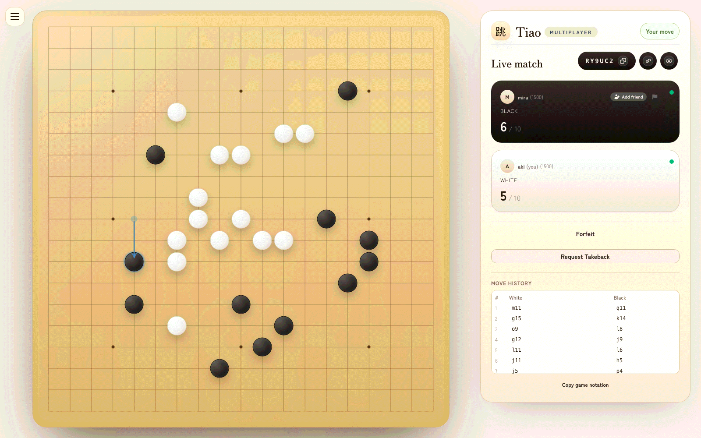

# Tiao

Tiao (跳, "jump") is an open-source multiplayer board game platform. Two players place and jump pieces on a 19x19 board, competing to be the first to capture 10 enemy stones. Think of it as the [Lichess](https://lichess.org) for Tiao — free, open-source, and community-driven.



## The Game

Players take turns placing pieces or jumping over enemy pieces to capture them:

```
  Place a piece:          Jump to capture:

  . . . . .              . . . . .         . . . . .
  . . . . .              . W . . .         . . . . .
  . . W . .              . . B . .   -->   . . x . .
  . . . . .              . . . . .         . . . W .
  . . . . .              . . . . .         . . . . .
```

Jumps can chain — keep jumping with the same piece if more captures are available. First to 10 captures wins.

For the complete rulebook, see [docs/GAME_RULES.md](docs/GAME_RULES.md).

## Features

- **Local play** — two players on the same device
- **Computer opponent** — play against an AI with multiple difficulty levels
- **Online multiplayer** — real-time games over WebSocket
- **Matchmaking** — automatic opponent pairing
- **Tournaments** — create and join tournaments with bracket play
- **Friends and invitations** — add friends, invite them to games
- **Game history** — browse your past matches with move-by-move review
- **Public profiles** — player stats, ratings, and badges
- **Accounts** — sign up with email/password or OAuth (GitHub, Google, Discord), or play as a guest
- **Tutorial** — interactive tutorial to learn the game rules

## Quick Start

**Prerequisites:** Node.js 22.x, Docker, npm

```bash
git clone https://github.com/YOUR_USERNAME/tiao.git
cd tiao
npm install

# Start local infrastructure (MongoDB + RustFS for S3-compatible storage)
npm run dev:infra

# Start development servers
npm run dev
```

No `.env` file needed — `server/.env.development` ships with defaults that point at the local Docker containers. If you need custom settings (e.g. real AWS credentials), create `server/.env` and it will take precedence.

By default, the dev script picks random free ports (printed on startup) to avoid conflicts. Use `npm run dev:fixed` for fixed ports (client on `http://localhost:3000`, server on `http://localhost:5005`). The Next.js dev server proxies API and WebSocket requests to the Express backend automatically. Uploaded files go to local RustFS (S3-compatible), browsable at `http://localhost:9001/rustfs/console/` (user: `minioadmin`, password: `minioadmin`).

### Available Commands

```bash
npm run dev              # Start client + server with hot reload (random ports)
npm run dev:fixed        # Same, with fixed ports (3000 + 5005)
npm run dev:lan          # Same, accessible from local network
npm run dev:infra        # Start local MongoDB + RustFS + Redis containers
npm run dev:infra:stop   # Stop containers (data preserved)
npm run dev:infra:reset  # Stop containers and wipe all data (clean slate)
npm run client           # Start only the Next.js frontend
npm run server           # Start only the Express backend
npm run test:unit        # Run unit tests (server + client)
npm run test:e2e         # Run Playwright end-to-end tests
npm run typecheck        # TypeScript type checking
npm run eslint           # Lint both client and server
```

## Project Structure

```
tiao/
├── client/          React + Next.js + Tailwind frontend
├── server/          Express + WebSocket backend
├── shared/          Pure TypeScript game engine + protocol types
├── desktop/         Electron wrapper (Phase 3a — standalone + Steam)
├── e2e/             Playwright end-to-end tests
├── docs/            Markdown documentation
└── docs-site/       Docusaurus documentation site
```

The game engine (`shared/src/tiao.ts`) is a set of pure functions with no side effects — both the server and client use it to validate and apply moves.

## Desktop app

Phase 3a wraps the web client in an Electron shell for macOS / Windows / Linux distribution via itch.io and (Phase 3b) Steam. The Electron main process loads a static export of `client/` from a custom `app://tiao/` protocol handler; API calls go to whatever `TIAO_API_URL` points at (default: `http://localhost:5005` in dev, `https://api.playtiao.com` in packaged builds). See [docs/investigations/016-cross-platform-distribution.md](docs/investigations/016-cross-platform-distribution.md) and ADR #13 for the full context.

```bash
# One-stop dev command: starts the Express backend on a random free
# port (Redis-shared state with any other `npm run dev` on the same
# machine), rebuilds the Electron client-bundle against that port,
# then launches Electron.
npm run dev:desktop

# Point at the live api.playtiao.com backend instead of a local one:
npm run dev:desktop:prod

# Package installers for the host platform (unsigned, for alpha testing):
cd desktop && npm run package

# Steam variant (appid 5035580; needs a running Steam client to init):
cd desktop && npm run package:steam
```

### Gated subsystems

Four env vars flip on specific subsystems. All are unset by default so standard dev is quiet:

| Env var | Effect |
|---|---|
| `TIAO_API_URL` | Override the API base URL at launch (runtime, no rebuild) |
| `STEAM_BUILD=true` | Initialize Steamworks at bootstrap via `desktop/src/steam.cjs` |
| `TIAO_ENABLE_UPDATER=1` | Turn on electron-updater polling against GitHub Releases (gated until macOS signing lands) |
| `TIAO_GLITCHTIP_DSN_DESKTOP` | Enable main-process crash reporting (gated until a desktop GlitchTip project is provisioned) |

### Desktop-specific docs

- `desktop/README.md` — build / package / signing walkthrough
- `desktop/src/steam.cjs` — Steamworks integration points (Phase 3b scaffold)
- `desktop/src/glitchtip.cjs` — main-process crash reporting wrapper
- `docs/RELEASING-desktop.md` — signed builds and publishing for direct downloads, itch.io, Steam, Mac App Store and Microsoft Store
- `.github/workflows/build-desktop.yml` / `publish-desktop.yml` — build once, publish the tested run

## Documentation

| Document                                                 | Description                                       |
| -------------------------------------------------------- | ------------------------------------------------- |
| [docs/GAME_RULES.md](docs/GAME_RULES.md)                 | Complete game rules with diagrams                 |
| [docs/ARCHITECTURE.md](docs/ARCHITECTURE.md)             | System design, data flow, and technical decisions |
| [docs/API.md](docs/API.md)                               | REST and WebSocket API reference                  |
| [docs/TESTING.md](docs/TESTING.md)                       | Testing guide, harnesses, and how to add tests    |
| [CONTRIBUTING.md](CONTRIBUTING.md)                       | How to contribute                                 |
| [docs/coolify-deployment.md](docs/coolify-deployment.md) | Coolify/Docker deployment guide                   |

## Testing

```bash
# All unit tests (server + client)
npm run test:unit

# E2E tests (spawns isolated test infrastructure)
npm run test:e2e

# Everything
npm test
```

See [docs/TESTING.md](docs/TESTING.md) for the full guide.

## Deployment

Production runs as two Docker containers:

- **client** — Node.js serving the Next.js app, proxying `/api` and `/ws` to the backend
- **server** — Express + WebSocket on a single Node.js process

### Required Environment Variables

**Backend:**

- `MONGODB_URI` — MongoDB connection string
- `TOKEN_SECRET` — secret for session token hashing (also used as `BETTER_AUTH_SECRET` fallback)
- `S3_BUCKET_NAME`, `S3_PUBLIC_URL` — for profile picture uploads
- `AWS_REGION`, `AWS_ACCESS_KEY_ID`, `AWS_SECRET_ACCESS_KEY`

**Optional:**

- `FRONTEND_URL` — for CORS and better-auth base URL
- `S3_ENDPOINT`, `S3_FORCE_PATH_STYLE` — for S3-compatible providers (MinIO, etc.)
- `REDIS_URL` — enables distributed matchmaking, locks, and rate limiting (falls back to in-memory)
- `PORT` — server port (defaults to 5005 in dev)
- `GITHUB_CLIENT_ID`, `GITHUB_CLIENT_SECRET` — GitHub OAuth
- `GOOGLE_CLIENT_ID`, `GOOGLE_CLIENT_SECRET` — Google OAuth
- `DISCORD_CLIENT_ID`, `DISCORD_CLIENT_SECRET` — Discord OAuth

See `.env.example` files in `server/` and `client/` for templates.

### CI/CD

The GitHub Actions workflow (`build-and-deploy.yml`) builds and tests on every push to `main`, then pushes Docker images to GHCR. Optional Coolify deployment is triggered via API if the secrets are configured.

See [docs/coolify-deployment.md](docs/coolify-deployment.md) for the full deployment guide.

## Contributing

See [CONTRIBUTING.md](CONTRIBUTING.md) for setup instructions, coding conventions, and how to submit changes.

## License

[GNU Affero General Public License v3.0](LICENSE), with one additional
permission: the desktop build may be linked against the proprietary
Steamworks SDK. See [LICENSE-EXCEPTIONS.md](LICENSE-EXCEPTIONS.md) for
the grant and the reasoning.

Contributions are accepted under the AGPL-3.0 and that exception
together.
